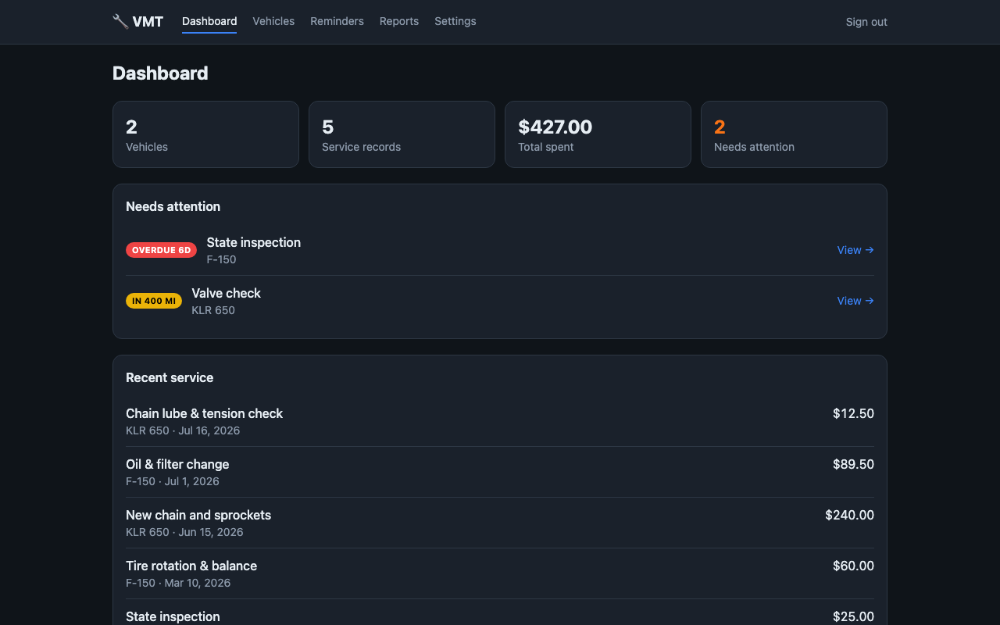
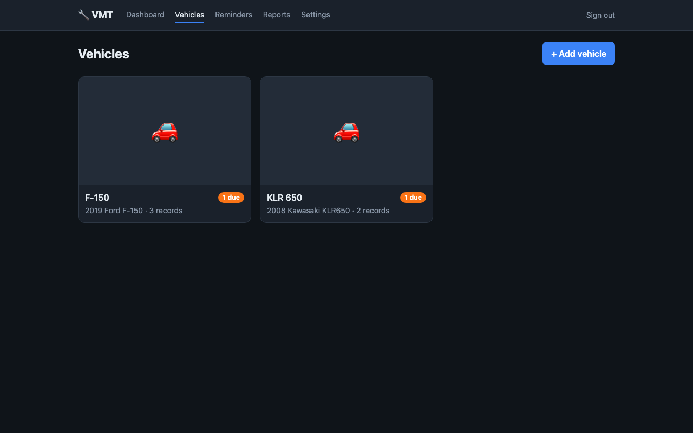
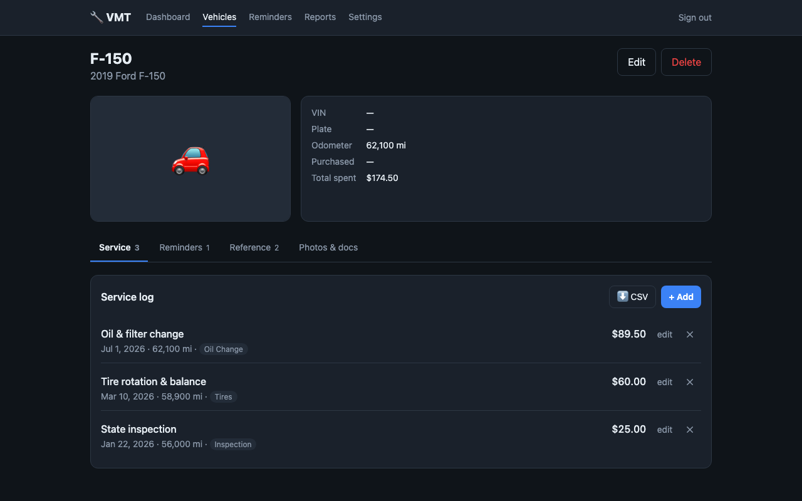
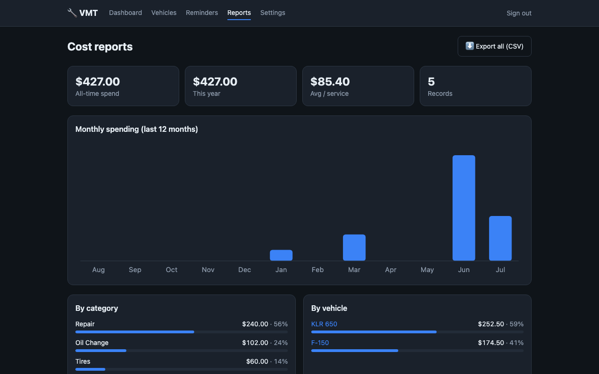
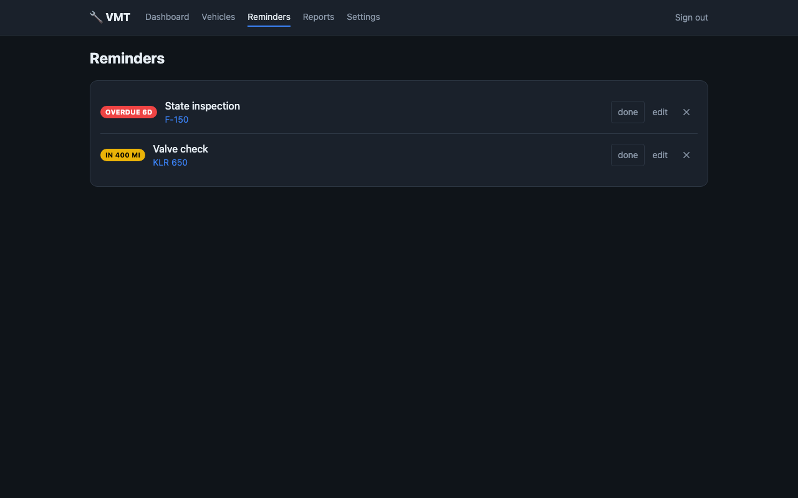
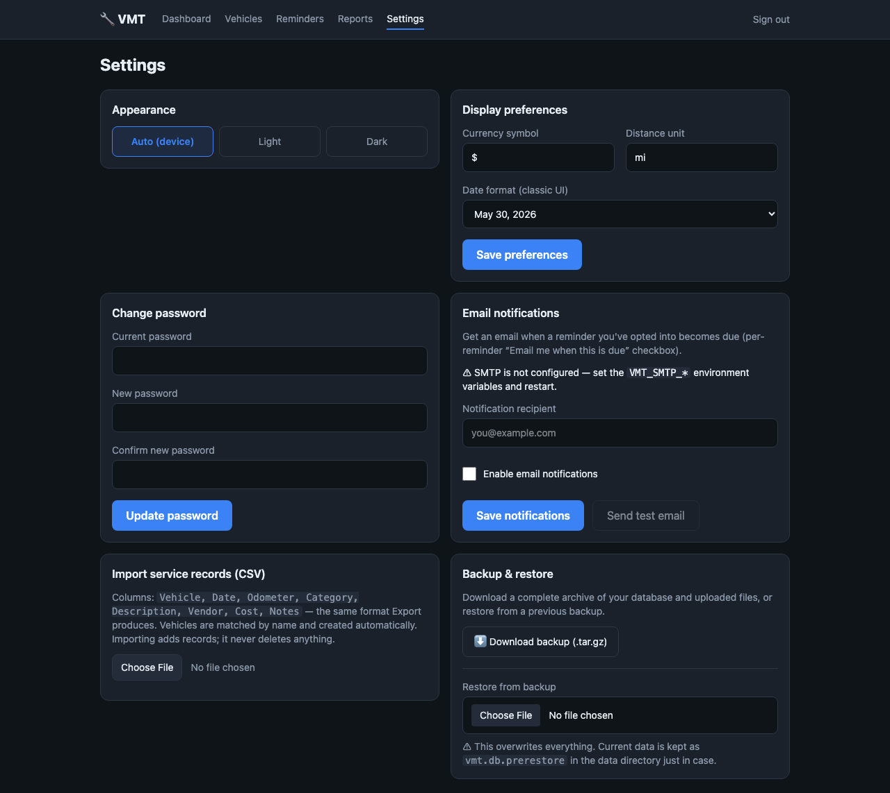
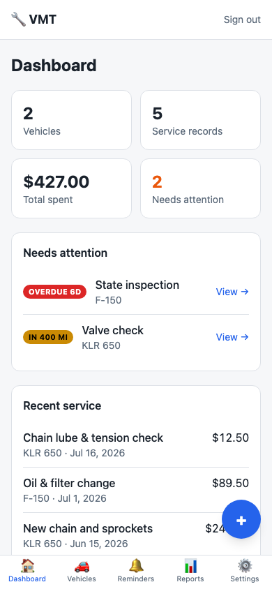

# VMT — Vehicle Maintenance Tracker

A self-hosted web app for tracking vehicle maintenance: identity details (incl.
VIN and photos), a full service log with reminders, document/receipt storage,
and cost reports with charts.

Built as a single Go binary with an embedded SQLite database and an embedded
React UI (an installable PWA) — no external database server, nothing to run but
the one binary. The app serves plain HTTP on a single port; put it behind your
own reverse proxy / TLS terminator (it's configured for
`vmt.int.paulandjenn.com`).

## Screenshots

| Dashboard | Vehicles | Vehicle detail |
|---|---|---|
|  |  |  |

| Reports | Reminders | Settings |
|---|---|---|
|  |  |  |

On phones the app switches to a bottom tab bar with a quick-log button, and can
be installed to the home screen:



## Features

- **Vehicles** — name, make/model/year, VIN, plate, color, odometer, purchase
  date, notes, and a photo gallery (set any photo as the primary image). Make
  and model offer suggestions from a bundled offline list of cars **and
  motorcycles** (model filtered by the chosen make) while still accepting any
  custom value you type; model year is a dropdown.
- **Archive** — sold or retired a vehicle? Archive it instead of deleting. It
  keeps every record but drops out of the vehicle list, the dashboard's running
  totals and the reminders, living on its own **Archived vehicles** page. Its
  past spending still counts in the cost reports, and unarchiving restores it.
- **Service log** — date, odometer, category, description, vendor, and cost per
  record. Odometer auto-advances the vehicle's current reading.
- **Reminders** — by due date, by odometer, or recurring (every N months/miles).
  Status badges show *overdue / due / soon*. Completing a recurring reminder
  schedules the next one automatically. Reminders can optionally **email you**
  when they come due (opt-in per reminder; see Email notifications below).
- **Documents & receipts** — attach files to a vehicle or to a specific service
  record.
- **Reference & specs** — a per-vehicle quick-reference on the vehicle page for
  parts/filters (name, part number, manufacturer, spec) and fluids (capacity,
  grade/type, brand) so the details you look up at every service live in one
  place.
- **Cost reports** — all-time and yearly spend, average per service, monthly
  spending chart (last 12 months), and breakdowns by category and by vehicle.
  Charts are rendered server-side as inline SVG (no client JS dependency).
- **CSV export & import** — export the full service log (Reports page) or a
  single vehicle's records (vehicle page) as RFC 4180 CSV; import service records
  from a CSV in the same format (Settings → Import), with a **preview/dry-run**
  before anything is written. Vehicles are matched by name and created
  automatically when missing; dates/costs are parsed leniently ($, commas, common
  date formats) and unparseable rows are reported, not lost.
- **Single-password login** — one household password protects everything,
  stored as a bcrypt hash; sessions are server-side and survive restarts.

## Quick start (Docker)

```bash
cp .env.example .env
# edit .env — optionally set VMT_ADMIN_PASSWORD
docker volume create vmt_data        # one-time: the data volume (external)
docker compose up -d --build
```

The app does **not** publish a host port; it listens on `8080` and joins the
external **`udBridge`** Docker network. Your reverse proxy (on the same network)
reaches it as **`vmt-app:8080`** and terminates TLS for
**`vmt.int.paulandjenn.com`** (see [Reverse proxy & TLS](#reverse-proxy--tls)).
The `udBridge` network must already exist on the host (`docker network create
udBridge` if not).

On first visit:
- If you set `VMT_ADMIN_PASSWORD`, log in with it.
- If you left it blank, you'll be prompted to create a password.

### Reverse proxy & TLS

This stack no longer bundles a web server / TLS — front it with your existing
proxy (Nginx Proxy Manager, Traefik, HAProxy, Caddy elsewhere, etc.). Put the
proxy on the shared `udBridge` network so it can reach the container by name,
and pass `X-Forwarded-Proto` so VMT marks its session cookie `Secure` over HTTPS.
Example Nginx server block:

```nginx
server {
    listen 443 ssl;
    server_name vmt.int.paulandjenn.com;
    # ssl_certificate / ssl_certificate_key ...

    client_max_body_size 40m;   # allow photo/document uploads & restores

    location / {
        proxy_pass         http://vmt-app:8080;   # container name on udBridge
        proxy_set_header   Host              $host;
        proxy_set_header   X-Forwarded-Proto $scheme;
        proxy_set_header   X-Real-IP         $remote_addr;
    }
}
```

## Deploying to a remote Docker host (GitHub Container Registry)

Deployment is split into two independent phases: you **push** the image to
**GHCR** (`ghcr.io`) from your laptop, and you **pull + restart** on the Docker
server as a separate, manual step. The server needs no source code or build
tooling. `docker-compose.prod.yml` references the registry image via `VMT_IMAGE`.

**One-time setup:**

- Create a GitHub **Personal Access Token** with the `write:packages` scope (and
  `read:packages` for pulling). A classic PAT is simplest.
- Set `VMT_IMAGE=ghcr.io/OWNER/vmt:latest` in your `.env` — `OWNER` is your GitHub
  username/org, **lowercase**.
- Log in to GHCR **locally** (to push) and once **on the server** (to pull):

  ```bash
  echo "$CR_PAT" | docker login ghcr.io -u OWNER --password-stdin
  ssh user@server 'echo "<token>" | docker login ghcr.io -u OWNER --password-stdin'
  ```

- The package is **private** by default until you change its visibility under the
  package settings on GitHub.
- Put the prod compose file + your `.env` on the server once:

  ```bash
  ssh user@server 'mkdir -p ~/vmt && docker volume create vmt_data'
  scp docker-compose.prod.yml user@server:vmt/
  scp .env                    user@server:vmt/
  ```

- Server needs Docker Engine + the Compose plugin; you need `buildx` locally
  (bundled with Docker Desktop) to cross-build `linux/amd64`.

### 1. Publish the image

**Automatically (CI):** `.github/workflows/publish.yml` builds and pushes the
`linux/amd64` image to GHCR on every push to `main` (tags `:latest`,
`:YYYY-MM-DD`, `:sha-<short>`) and on git tags `v*` (semver tags). It uses the
built-in `GITHUB_TOKEN`, so no PAT/secret setup is needed — just `git push`.

**Manually (from your laptop):** `push.sh` cross-builds `linux/amd64` and pushes
it — handy for a one-off without a commit:

```bash
./push.sh
# (equivalently)
docker buildx build --platform linux/amd64 --provenance=false \
  -t ghcr.io/OWNER/vmt:latest --push .
```

### 2. Pull + restart (on the Docker server, manual)

When you're ready to roll it out, on the server:

```bash
cd ~/vmt
docker compose -f docker-compose.prod.yml pull        # fetch the new image
docker compose -f docker-compose.prod.yml up -d        # recreate the container
docker compose -f docker-compose.prod.yml ps
docker compose -f docker-compose.prod.yml logs -f app
```

The two phases are decoupled: pushing a new image doesn't change the running
server until you run the pull/up step there. Your data in the `vmt_data` volume
is preserved across restarts and migrations run on startup.

On the remote host, point your reverse proxy for `vmt.int.paulandjenn.com` at
`vmt-app:8080` over the `udBridge` network (see
[Reverse proxy & TLS](#reverse-proxy--tls)) and create the DNS record. Then
browse to `https://vmt.int.paulandjenn.com` and log in.

**Updating later** is the same two steps: run `./push.sh` to publish a new image,
then run the pull/up commands on the server when you want it live. (`update.sh` is
for the *local* build-from-source stack; use `push.sh` + the manual server pull
for the registry-based remote.)

To migrate **existing data** to the remote (not needed for a fresh start): take a
backup from **Settings → Download backup** on the old instance and upload it via
**Settings → Restore** on the new one — or copy the `vmt_data` volume with the
`tar` one-liner under [Data & backups](#data--backups).

## Configuration

All configuration is via environment variables (see `.env.example`):

| Variable             | Default                            | Purpose                                          |
|----------------------|------------------------------------|--------------------------------------------------|
| `VMT_BASE_URL`       | `https://vmt.int.paulandjenn.com`  | Public URL; used for links in notification emails|
| `VMT_ADMIN_PASSWORD` | _(empty)_                          | Bootstraps the password on first run only        |
| `VMT_CURRENCY`       | `$`                                | Currency symbol in the UI                        |
| `VMT_DISTANCE_UNIT`  | `mi`                               | Odometer unit label                              |
| `VMT_DATE_FORMAT`    | `Jan 2, 2006`                      | Go time layout for displayed dates               |
| `TZ`                 | `UTC`                              | Timezone                                         |
| `VMT_ADDR`           | `:8080`                            | Listen address (inside the container)            |
| `VMT_DATA_DIR`       | `/data`                            | Where the SQLite DB and uploads live             |

SMTP variables for email notifications are listed under
[Email notifications](#email-notifications).

## Email notifications

Reminders can email you when they fall due. Setup:

1. Configure an SMTP server via environment variables (kept out of the database
   and backups):

   | Variable        | Example                | Notes                                   |
   |-----------------|------------------------|-----------------------------------------|
   | `VMT_SMTP_HOST` | `smtp.gmail.com`       | Leave blank to disable email entirely   |
   | `VMT_SMTP_PORT` | `587`                  | `587` STARTTLS, `465` implicit TLS      |
   | `VMT_SMTP_USER` | `you@gmail.com`        | Omit for unauthenticated relays         |
   | `VMT_SMTP_PASS` | `app-password`         |                                         |
   | `VMT_SMTP_FROM` | `vmt@example.com`      | Sender address                          |
   | `VMT_SMTP_TLS`  | `starttls`             | `starttls` (default), `implicit`, `none`|
   | `VMT_SMTP_INSECURE` | _(off)_            | `1` to skip TLS cert verification (self-signed servers) |
   | `VMT_BASE_URL`  | `https://vmt.example`  | Optional; adds a link to emails         |

2. In **Settings → Email notifications**, set the recipient address, tick
   **Enable email notifications**, and use **Send test email** to verify.

3. On each reminder, tick **Email me when this is due**.

A background job checks periodically and sends **one email per due/overdue
reminder** that has opted in, re-nudging weekly while an item stays due. Odometer
-based reminders are evaluated against the vehicle's current odometer, so they
trigger once you've logged enough mileage.

## Data & backups

Everything lives under the `vmt_data` Docker volume (`/data` in the container):

- `vmt.db` — the SQLite database (uses WAL mode)
- `uploads/` — photos and documents

### In-app backup & restore (recommended)

From **Settings → Backup & restore**:

- **Download backup** produces a single `vmt-backup-YYYYMMDD-HHMMSS.tar.gz`
  containing a consistent snapshot of the database (taken with SQLite
  `VACUUM INTO`, so it's transaction-safe and merges the WAL) plus all uploaded
  files.
- **Restore** uploads such an archive, validates it, atomically swaps the data
  into place, and **restarts the app** to load it. With the compose
  `restart: unless-stopped` policy the container comes back automatically; for a
  bare-metal/`go run` deployment you'll need to start the process again.

  Restore is destructive: it replaces all current data. The previous data is
  kept as `vmt.db.prerestore` and `uploads.prerestore` in the data directory so
  you can recover manually if needed. Invalid or non-VMT archives are rejected
  without touching your data.

### CSV import (service records)

From **Settings → Import service records (CSV)** you can bulk-load service history
from a CSV with the header `Vehicle, Date, Odometer, Category, Description,
Vendor, Cost, Notes` — the same format the app exports, so export one file as a
template. Uploading shows a **preview (dry-run)** first — a per-row breakdown of
what would import, which vehicles would be created, and which rows would be
skipped and why — and writes nothing until you click **Confirm**. Notes:

- Vehicles are matched by name (case-insensitive) and **created automatically**
  when they don't exist.
- Parsing is lenient: `Cost` ignores `$` and thousands separators; `Date` accepts
  ISO (`2026-05-01`), `MM/DD/YYYY`, and `Jan 2, 2006` styles; `Odometer` ignores
  commas. Only `Vehicle`, `Date`, and `Description` are required.
- Rows that can't be parsed are **skipped and reported** (with line numbers); the
  rest still import. A file missing a required column is rejected outright.
- Import is **additive** — it never deletes, and it does not de-duplicate, so
  re-importing the same file adds the rows again.

### Volume snapshot (alternative)

You can also snapshot the whole volume directly:

```bash
docker run --rm -v vmt_vmt_data:/data -v "$PWD":/backup alpine \
  tar czf /backup/vmt-backup.tar.gz -C /data .
```

## Updating

VMT is built from source by `docker compose` (there is no pre-published image),
so updating means rebuilding the image and recreating the containers. **Your
data is safe across updates** — it lives in the `vmt_data` volume, which is never
touched by a rebuild, and any schema changes are applied automatically and
idempotently on startup (see `internal/db/migrate`).

### One-shot update

A helper script does the whole dance (pull code, rebuild with fresh base images,
recreate, prune):

```bash
./update.sh
```

### Manual update

Equivalent steps if you prefer to run them yourself:

```bash
# 1. (Recommended) take a backup first — Settings → Download backup,
#    or snapshot the volume (see "Data & backups" above).

# 2. Get the new code (skip if you deploy by copying files).
git pull --ff-only

# 3. Rebuild the app image, pulling newer golang/alpine base layers too
#    (this is what picks up OS-level security fixes).
docker compose build --pull

# 4. Recreate the container.
docker compose up -d

# 5. Reclaim space from the now-dangling old image.
docker image prune -f
```

`docker compose up -d` recreates the container when its image or config changed,
so in practice the app restarts (a brief blip). Confirm afterwards:

```bash
docker compose ps          # both Up; app should be (healthy)
docker compose logs -f app # watch startup / migrations
```

### Pinning vs. latest

- **App base images** are pinned in the `Dockerfile` (`golang:1.23-alpine`,
  `alpine:3.20`). Bumping those tags and rebuilding is how you move the app's OS
  baseline forward — `--pull` only refreshes within the pinned tag.
- **The reverse proxy** in front of VMT is managed separately (outside this
  stack), so update it on its own cadence.

### Rolling back

If an update misbehaves:

```bash
git checkout <previous-commit>   # or restore the previous files
docker compose up -d --build
```

If a release ever changes the schema in an incompatible way, restore the backup
you took in step 1 via **Settings → Restore** (the app keeps the pre-restore data
as `*.prerestore` in the volume as an extra safety net).

## Local development

Requires Go 1.23+.

```bash
go mod download
VMT_ADMIN_PASSWORD=changeme go run .
# open http://localhost:8080
```

Run checks:

```bash
go vet ./...
go build ./...
```

## Architecture

```
main.go                  wiring, graceful shutdown
internal/config          env-based configuration
internal/db              SQLite open + embedded schema (schema.sql)
internal/auth            bcrypt password + DB-backed sessions
internal/models          domain types
internal/handlers        routing, request handlers, SQL, SVG charts
internal/mail            SMTP sender for reminder notifications
web/templates            html/template pages (server-rendered)
web/static               CSS + vendored htmx.min.js + favicon
```

The router uses Go 1.22+ `net/http.ServeMux` method+pattern routing — no
third-party web framework. HTMX is vendored locally so the app is fully
self-contained and works offline.

## Security notes

- The app serves plain HTTP and is meant to sit **behind your own reverse proxy
  / TLS terminator**. It publishes no host port — it's only reachable over the
  internal `udBridge` network (proxy-only access), so it's never exposed on the
  host's interfaces.
- Session cookies are `HttpOnly`, `SameSite=Lax`, and marked `Secure` when the
  request arrives over HTTPS — which the app detects from the `X-Forwarded-Proto`
  header, so configure your proxy to send it.
- Uploaded files are served only to authenticated sessions.
